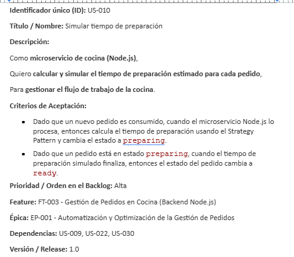
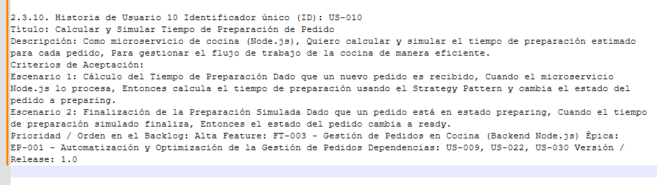

# Hallazgos "As Is"

## Resumen post-entrevista
El proyecto implementa un sistema distribuido de gestión de pedidos para restaurantes de comidas rápidas, con una arquitectura de microservicios funcional y bien estructurada. El sistema permite a los meseros tomar pedidos desde una tablet, que luego son procesados por un microservicio Python (FastAPI) y publicados en RabbitMQ. Un microservicio Node.js consume estos mensajes, simula la preparación en cocina y expone el estado de los pedidos en tiempo real a través de HTTP y WebSockets para la vista de cocina. Se han corregido violaciones críticas a los principios SOLID y se han implementado patrones de diseño como Strategy, Repository y Singleton, mejorando significativamente la mantenibilidad y escalabilidad del código. La refactorización del frontend ha separado responsabilidades, y se ha migrado la persistencia de pedidos a MongoDB. El valor esperado es digitalizar y automatizar el flujo completo de la toma de pedidos hasta la entrega, mejorando la comunicación en tiempo real entre meseros y cocina.

## Análisis de ambigüedades

En este ámbito, las ambigüedades encontradas se basan en el análisis seleccionado de 'Épicas e Historias de usuarios' y luego de 5 iteraciones, el resultado que se obtuvo fue el siguiente:

### 1. Seguridad y autorización
- Autenticación: Se utilizará Firebase para la lógica de autenticación y la gestión del token (Iteración 3).
- Autorización: Cada microservicio gestionará su propia lógica de autorización y roles/claims extraídos del token (Iteraciones 3 y 4). Se descartó un servicio de autorización centralizado (Iteración 4).

### 2. Operaciones y monitoreo
- Monitoreo: Se mantiene el Monitoreo Manual de Logs con revisiones diarias programadas (Iteraciones 3 y 4). Se descarta la implementación de herramientas proactivas (ej. Prometheus/Grafana) (Iteraciones 3 y 4).
- Logging API: Solo se registrarán errores críticos en la consola del servidor del API Gateway, sin almacenamiento persistente (Iteración 4).
- Gestión DLQ: Implementar un mecanismo de reintento automático limitado, seguido de un sistema de alertas para fallos persistentes (Iteración 1).

### 3. Concurrencia y edición de pedidos
- Mecanismo: Se implementa un mecanismo de Bloqueo Optimista o Pesimista al editar pedidos (Iteraciones 3 y 4).
- Experiencia de usuario: El error que notifica al mesero es actualmente genérico ("service error"). Falta ser más específico en el mensaje para notificar que el cocinero ya inició la preparación (Iteraciones 3 y 4).
- Concurrencia de mesas: Se utilizará un Bloqueo Pesimista Temporal de la mesa al inicio de la edición (asignación) para evitar conflictos (Iteración 4).

### 4. Modelo de Datos y Flexibilidad Funcional
- Estructura de catálogo: Se usará un esquema fijo con campos predefinidos, sin soporte para variaciones complejas (ej. tamaño, adiciones) en esta versión (Iteraciones 3 y 4). El catálogo es rígido y no podrá manejar variaciones de productos. Este es un alcance funcional limitado para la versión.
- Estructura de reglas: Las estrategias de tiempo se limitarán a un documento JSON simple clave-valor, sin lógica condicional o priorización en el JSON (Iteración 3 y 4).
- Prioridad de la simulación: El cambio manual del cocinero tiene prioridad sobre la simulación automática de tiempo de preparación (Iteración 3).

Para el proyecto se ha tomado decisiones definitivas en la mayoría de las áreas funcionales, optando generalmente por soluciones sencillas y con limitaciones de alcance para la primera versión. Sin embargo, las dos áreas de mayor riesgo se concentran en las prácticas de DevOps/Operaciones y Seguridad:

- Seguridad (Autorización): El costo de mantener la autorización descentralizada crecerá con cada nueva funcionalidad o microservicio.

- Operaciones (Monitoreo): El sistema es ciego a los fallos en tiempo real, lo que garantiza tiempos de inactividad prolongados en caso de fallos críticos en la infraestructura de mensajes o la API Gateway.

# Expectativa "To be"

## Plan de mejora (ft. ATLAS y SKAI)
Una vez que se obtuvieron las historias de usuario por medio de IRIS, seleccionamos 5 historias de usuario de interés, las cuales responden oportunamente a los dolores manifestado en la entrevista con los expertos. Con esto definido, procedimos al refinamiento de las historias apoyándonos en ATLAS y SKAI donde primero ATLAS analiza primero el contexto para ofrecer después una documentación extensa que incluye los criterios de aceptación, la funcionalidad habilitada relacionada a la HU, la descripción funcional en conjunto con las reglas de negocio que se deberán seguir, entre otros aspectos técnicos para lograr un buen resultado. Luego SKAI basado en una plantilla genera los casos de prueba a considerar por cada HU.

## Refinamiento con GEMS
Se realizó la creación de una gema con una configuración que permita el refinamiento de las HUs dadas por ATLAS y SKAI bajo el principio INVEST. Generando así lo que es un REFINED_BACKLOG.md y en contraste observamos el antes y después del refinamiento.

Antes

Después

# Resultado final
