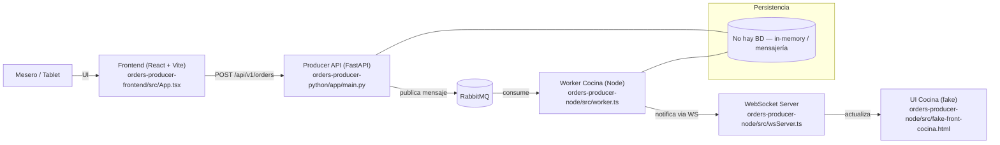

...existing code...

# Arquitectura — SistemaDePedidosRestaurante

Resumen por capas
- Frontend (UI)
  - Responsable de la captura de pedidos y construcción del payload HTTP.
  - Componentes clave: [`App`](orders-producer-frontend/src/App.tsx), [`OrderSidebar`](orders-producer-frontend/src/components/OrderSidebar.tsx), [`ProductCard`](orders-producer-frontend/src/components/ProductCard.tsx).
  - Envío: POST a `/api/v1/orders/` (ver [`API_URL` en App`](orders-producer-frontend/src/App.tsx)).

- Controllers (API / endpoints)
  - Expone endpoints HTTP, valida entrada y delega a services.
  - Python: [`create_order_endpoint`](orders-producer-python/app/controllers/order_controller.py) — recibe `OrderIn` y llama a service.

- Services (Lógica de negocio)
  - Construyen mensajes/dominios, aplican reglas y publican a mensajería.
  - Python: [`create_order`](orders-producer-python/app/services/order_service.py) — crea `OrderMessage` y llama a [`publish_order`](orders-producer-python/app/messaging/messaging.py).

- Messaging / Broker
  - RabbitMQ transporta los pedidos (cola `orders.new`). Productor publica; worker consume.
  - Productor usa [`app.messaging.messaging.publish_order`](orders-producer-python/app/messaging/messaging.py).
  - Worker usa AMQP para consumir en [`orders-producer-node/src/worker.ts`](orders-producer-node/src/worker.ts).

- Worker / Cocina
  - Consume mensajes, calcula tiempos, mantiene pedidos en memoria y notifica por WebSocket.
  - Código relevante: [`startWorker`](orders-producer-node/src/worker.ts), [`kitchen.controller.ts`](orders-producer-node/src/controllers/kitchen.controller.ts), [`wsServer.ts`](orders-producer-node/src/wsServer.ts).

- Repositories / Persistencia
  - Actualmente no hay base de datos. Persistencia temporal:
    - Productor → publica a RabbitMQ (mensajería).
    - Cocina → mantiene `pedidosEnCocina` en memoria (`kitchen.controller.ts`).
  - Recomendación: añadir capa `repository` y BD (Postgres/Mongo) si se requiere persistencia.

Dependencias clave y frameworks

| Subproyecto | Framework / Paquete principal | Archivo de referencia |
|---|---:|---|
| Frontend | React, Vite, TypeScript | [orders-producer-frontend/package.json](orders-producer-frontend/package.json) |
| Frontend | React components | [orders-producer-frontend/src/App.tsx](orders-producer-frontend/src/App.tsx) |
| Producer API (Python) | FastAPI, Pydantic, pika | [orders-producer-python/requirements.txt](orders-producer-python/requirements.txt) |
| Producer API | Config / settings | [orders-producer-python/app/config.py](orders-producer-python/app/config.py) |
| Messaging (Python) | pika (RabbitMQ client) | [orders-producer-python/app/messaging/messaging.py](orders-producer-python/app/messaging/messaging.py) |
| Worker (Node) | amqplib (AMQP), express, ws | [orders-producer-node/package.json](orders-producer-node/package.json) |
| Worker (Node) | Worker / WebSocket | [orders-producer-node/src/worker.ts](orders-producer-node/src/worker.ts), [orders-producer-node/src/wsServer.ts](orders-producer-node/src/wsServer.ts) |

Archivos y símbolos importantes (acceso rápido)
- Frontend: [orders-producer-frontend/src/App.tsx](orders-producer-frontend/src/App.tsx)  
- Sidebar: [orders-producer-frontend/src/components/OrderSidebar.tsx](orders-producer-frontend/src/components/OrderSidebar.tsx)  
- Product view: [orders-producer-frontend/src/components/ProductCard.tsx](orders-producer-frontend/src/components/ProductCard.tsx)  
- Producer main: [orders-producer-python/app/main.py](orders-producer-python/app/main.py)  
- Producer controller: [orders-producer-python/app/controllers/order_controller.py](orders-producer-python/app/controllers/order_controller.py)  
- Producer service: [orders-producer-python/app/services/order_service.py](orders-producer-python/app/services/order_service.py)  
- Producer messaging: [orders-producer-python/app/messaging/messaging.py](orders-producer-python/app/messaging/messaging.py)  
- Worker: [orders-producer-node/src/worker.ts](orders-producer-node/src/worker.ts)  
- Cocina controller (in-memory): [orders-producer-node/src/controllers/kitchen.controller.ts](orders-producer-node/src/controllers/kitchen.controller.ts)  
- WebSocket: [orders-producer-node/src/wsServer.ts](orders-producer-node/src/wsServer.ts)

Cómo extender / dónde cambiar precios (rápido)
- Mostrar o cambiar precio en UI: editar [`ProductCard`](orders-producer-frontend/src/components/ProductCard.tsx) y [`OrderSidebar`](orders-producer-frontend/src/components/OrderSidebar.tsx).
- Cálculo / payload enviado: ver reducción `total` y transformación en [`orders-producer-frontend/src/App.tsx`](orders-producer-frontend/src/App.tsx) (map a `unitPrice`).

Guía rápida de ejecución (local)
- Frontend:
  - cd orders-producer-frontend
  - npm install
  - npm run dev
- Producer API (Python):
  - cd orders-producer-python
  - create `.env` con CLOUDAMQP_URL
  - pip install -r requirements.txt
  - uvicorn app.main:app --reload --port 8000
- Worker & WS (Node):
  - cd orders-producer-node
  - npm install
  - npm run dev

Licencia / notas
- Este README refleja la estructura actual del repositorio. Para añadir persistencia o autenticación, agregue capas `repository` y `auth` y documente endpoints en OpenAPI/Swagger (FastAPI lo genera automáticamente).